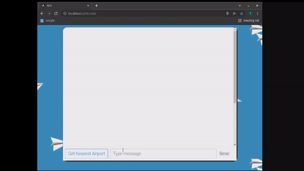

# Customer Service Chatbot for [ThinkTwice 2022](https://thinktwice.pt/)

## Objective 

The main goal of this project is to implement a customer service chatbot for the travel industry, using Artificial Intelligence.


## Core Funcionalities

 * Basic Q&A 
 *  Get the nearest airport of our current location
 *  Get flights according:
    - the departure city, the arrival city or both
    - the airline name
    - the departure date
  * All flights shown are ordered by price ascending
  * Book a flight
  * Request human help
  * Recieve user feedback


## Demonstration 




## How to run
```
# 1. Open a terminal in the root folder and run the following commands
cd backend/spoton
python3 manage.py runserver

# 2. Open another terminal in the root folder and run the following commands
cd frontend/app
ng serve

# 3. Access localhost:4200 through a browser
```

## Authors

| Name              |          github profile  |
| ----------------- | -----------------------: |
| João Reis         | [joaoreis16](https://github.com/joaoreis16)   |
| Paulo Pereira     | [PauloGSP](https://github.com/PauloGSP)  |
| Ricardo Rodriguez | [ricardombrodriguez](https://github.com/ricardombrodriguez)   |


